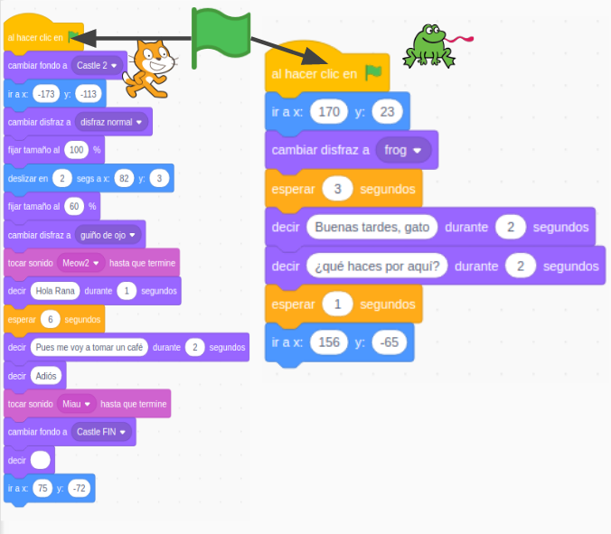

# Introducción a la programación, robótica y 3D

## CEP Úbeda
## Enero 20222

## José Antonio Vacas @javacasm 

## [https://github.com/javacasm/RoboticaSTEAMUbeda](https://github.com/javacasm/RoboticaSTEAMUbeda)

Curso Semipresencial: 3 sesiones online de 3h + 3 Sesiones presenciales + trabajo personal

## Objetivos

- Implementar la robótica educativa como contenido y/o estrategia metodológica en el aula.
- Conocer los conceptos básicos de robótica: Control de Sensores y actuadores.
- Conocer la estructura de un robot y sus movimientos: grados de libertad y trayectorias.
- Conocer el control de robots con arduino.
- Conocer casos de ejemplos prácticos

## Contenidos

El objetivo del presente curso es el utilizar estas herramientas para realizar diferentes proyectos educativos, por lo que su carácter es eminentemente práctico.

1. [Programación en la educación](./scratch/1.0.ProgramacionEnEducacion.md)
1. [Programando con bloques: Scratch](./scratch/3.0.Scratch3.0.md)
1. [El pensamiento computacional y los juegos](./scratch/9.0.PC_Unplugged.md)
1. [Robótica en educación](./scratch/8.1.0.RoboticaEducacion.md)
1. [Robótica con micro:bit](./microbit/0.Introduccion.md)
1. [Programación de Arduino](./arduino/arduinoblocks.md)
1. [Uso de impresoras 3D](./3D/README.md)
1. [Introducción al diseño 3D](./3D/9.0.HerramientasDiseño3D.md)

## Descripción

La robótica supone un desafío cognitivo de gran riqueza pedagógica para el alumnado. La propuesta pretende ser máximamente inclusiva, tal y como se refleja en las observaciones y el baremo.

En este sentido, la formación que se propone se basa en tecnologías de bajo coste y código abierto y pretende abrir una ventana a la robótica a todo el alumnado de todos los niveles preuniversitarios (ESO-Bachillerato), desde una perspectiva integradora y transversal de la robótica. 

La robótica permite a los estudiantes experimentar la aplicación práctica de diferentes conceptos de física, matemáticas, tecnología y proyectos en general enriqueciendo y facilitando el aprendizaje de contenidos curriculares. Esta filosofía ha calado hondo en multitud de usuarios difundiendo conocimientos, herramientas y proyectos.

Desde el ámbito de la enseñanza no debemos ser ajenos a esta necesidad, conscientes de lo atractivo que es para el alumnado todo lo relacionado con la programación, la electrónica y la robótica.

## EVALUACIÓN

El curso cuenta con una parte no presencial que se justificará mediante el diseño y puesta en práctica del proyecto elegido por cada participante en el aula. Para ello contarán con la ayuda del tutor. 

## Duración

7 sesiones semipresenciales de 3 horas: 25 horas

* 2 sesiones Programación
* 3 sesiones robótica
* 2 sesiones 3D

### Sesiones de la actividad

Fecha	|Horario
---|---
13/1/2022|17:00-20:00
20/1/2022|17:00-20:00
27/1/2022|17:00-20:00
03/2/2022|17:00-20:00
10/2/2022|17:00-20:00
17/2/2021|17:00-20:00
24/2/2021|17:00-20:00

## Herramientas

[Pensamiento computacional desconectado](https://csunplugged.org/es/)

[Scratch](https://scratch.mit.edu/)

[micro:bit](http://microbit.org/)

[Arduino](arduinoblocks.com)

[Tinkercad](https://tinkercad.com)

### Recursos

[Propuesta con objetivos mínimos para cada nivel educativo de Intef](http://code.intef.es/wp-content/uploads/2018/10/Ponencia-sobre-Pensamiento-Computacional.-Informe-Final.pdf#page=65)